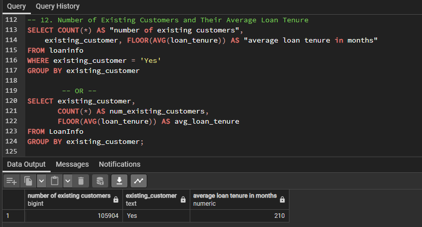

# Comprehensive-Insights-into-India's-Two-wheeler-Loan-Applicant-Profiles
This provides a comprehensive overview of potential loan applicants' profiles, specifically tailored for the Indian demographic. It encapsulates a range of features, from basic demographics to financial details, that can be instrumental in assessing the creditworthiness of an individual.

## Introduction
In today's highly competitive financial services sector, data-driven decision-making is crucial for maintaining a competitive edge and ensuring customer satisfaction. This project aims to provide a comprehensive data analysis and insights into various aspects of a financial services organization, enabling better understanding of customer behavior, risk assessment, and strategic planning.
In today's highly competitive financial services sector, data-driven decision-making is crucial for maintaining a competitive edge and ensuring customer satisfaction. This project, titled 'LoanInfo Analysis,' aims to provide a comprehensive data analysis and insights into various aspects of a financial services organization. By leveraging SQL, we will delve into the intricacies of customer behavior, risk assessment, and strategic planning. SQL will be our primary tool for extracting, transforming, and analyzing the data from the 'LoanInfo' database, enabling us to make informed decisions and optimize our operations in this dynamic industry."

## Problem Statement
The financial services company faces several key challenges that need to be addressed:  
Understanding customer demographics and preferences to tailor financial products.  
Assessing the risk profile of customers to make informed lending decisions.  
Identifying patterns of loan default and minimizing associated losses.  
Optimizing marketing strategies based on customer attributes.  
Analyzing the performance of different financial products.  
 In order to help solve these challenges, I had to answer the following questions 
1. What is the average loan amount for each occupation type (e.g., Doctor, Software Engineer, Banker, etc.)?
2. How many applicants have a credit history length of less than 3 years and a credit score below 500?
3. What is the highest loan-to-value (LTV) ratio for female applicants who are self-employed?
4. What is the average income of applicants from Bengaluru, Karnataka, who have a credit score above 600?
5. How many applicants have an income greater than 100,000 and a profile score above 80?.
6. What is the total loan amount requested by applicants in each state?
7. How many applicants are salaried workers and have more than 5 existing loans?
8. What is the average credit score for applicants in the age group of 50 to 60 years?
9. What is the distribution of occupations among female applicants who are existing customers?
10. What is the number of Male and Female Applicants?
11. What is the Average Credit Score of Self-Employed Applicants?
12. What is the number of Existing Customers and their Average Loan Tenure?
13. What is the Highest Loan Amount Requested?
14. What is the Total Number of Existing Loans Across All Applicants?

## Project Objective
In today's highly competitive financial services sector, data-driven decision-making is crucial for maintaining a competitive edge and ensuring customer satisfaction. This project aims to provide a comprehensive data analysis and insights into various aspects of a financial services organization. By leveraging SQL, we will delve into the intricacies of customer behavior, risk assessment, and strategic planning. SQL will be our primary tool for extracting, transforming, and analyzing the data from the 'LoanInfo' database, enabling us to make informed decisions and optimize our operations in this dynamic industry.  
Additionally, Power BI will play a pivotal role in this project, as we will use it to create interactive, communicative, and excellent dashboards. These dashboards will visually represent our findings, making it easier to communicate insights and trends to stakeholders. By combining SQL's data processing capabilities with Power BI's visualization prowess, we aim to provide a holistic and powerful solution for enhancing our organization's data-driven decision-making process.  
**Dataset:** I was provided with the credit dataset containing the following columns  
•	Age  
•	Gender  
•	Income  
•	Credit score   
•	Credit history length  
•	Number of existing loans  
•	Loan amount   
•	Loan tenure  
•	Existing customer  
•	State  
•	City  
•	LTV ratio  
•	Employment profile  
•	Profile score  
•	Occupation  

## Data Analysis
I conducted an in-depth analysis of the provided customer loan dataset, which included information on Customer Demographics, Credit Risk Assessment, Loan Default Analysis, Customer Segmentation, Financial Product Performance and more. The analysis covered a wide range of key questions like distribution of loan tenure among applicants with a credit score above 750, total loan amount requested by applicants in each state, number of Male and Female Applicants, average credit score for applicants in the age group of 50 to 60 years.
The first thing I had to do was to replicate the table into my SQL database.

The table has been created in the SQL database 

1. What is the average loan amount for each occupation type (e.g., Doctor, Software Engineer, Banker, etc.)?  
This query allows us to see the average loan amount requested by applicants from different occupation types. It helps identify borrowing patterns and preferences based on the 
occupation.

2. How many applicants have a credit history length of less than 3 years and a credit score below 500?  
This query gives us the count of applicants who have a relatively short credit history (less than 3 years which is 36 months since the column is in months) and a low credit score (below 500). It's useful for identifying applicants with potentially higher risk profiles.  
We have 4642 applicants have a credit history length of less than 3 years and a credit score below 500.

3. What is the highest loan-to-value (LTV) ratio for female applicants who are self-employed?  
This query helps find the highest LTV ratio among self-employed female applicants. LTV ratios indicate the risk associated with loans, so identifying the highest ratio for this specific group can provide insights into potential risk factors.  
The LTV ratio for female applicants who are Self-Employed is 95.00.

4. What is the average income of applicants from Bengaluru, Karnataka, who have a credit score above 600?  
This query calculates the average income of applicants from Bengaluru, Karnataka, who have a good credit score (above 600). It provides insights into the income levels of potentially creditworthy applicants in this region.  
The average income of applicants from Bengaluru and Karnataka is 82,200.  

5. How many applicants have an income greater than 100,000 and a profile score above 80?  
This query identifies the count of applicants who meet two specific criteria: a high income (greater than 100,000) and a high profile score (above 80). This can help identify financially stable and creditworthy applicants.  

6. What is the total loan amount requested by applicants in each state?  
This query provides a breakdown of the total loan amount requested by applicants in each state. It helps in understanding the demand for loans across different geographical regions.  

7. How many applicants are salaried workers and have more than 5 existing loans?  
This query identifies the count of applicants who are salaried workers and have a high number of existing loans (more than 5). It can help identify potential financial stress among salaried applicants.  
We have 59888 applicants who are salaried workers and have more than 5 existing loans.

8. What is the average credit score for applicants in the age group of 50 to 60 years?  
This query calculates the average credit score for applicants in the age group of 50 to 60 years. It provides insights into the creditworthiness of this specific age group.  
We have 53464 applicants who are aged between 50 years and 60 years and their average credit score is 600. 

9. What is the distribution of occupations among female applicants who are existing customers?  
This query breaks down the distribution of occupations among female applicants who are existing customers. It can provide insights into the diversity of occupations among loyal customers and help tailor services accordingly.  
There are 15 occupations among the female applicants who are existing customers.

10. What is the number of Male and Female Applicants?  
This query counts the number of male and female loan applicants. Knowing the gender distribution among applicants is valuable for gender-specific marketing strategies and assessing whether there's a gender bias in loan applications.  
There are 133,145 Female appicants.  
132,749 Male applicants.  
and 13,962 Other applicants.

11. What is the Average Credit Score of Self-Employed Applicants?  
This query calculates the average credit score of applicants who are self-employed. Understanding the creditworthiness of self-employed applicants is crucial, as they might have different risk profiles compared to salaried individuals.  
The average credit score of self-employed applicants is 581

12. What is the number of Existing Customers and their Average Loan Tenure?  
This query counts the number of existing customers and calculates their average loan tenure. Knowing the average loan tenure of existing customers helps in assessing customer loyalty and their preferences for loan durations.  
We have 105,904 existing customers and their average loan tenure is 210 months 

13. What is the Highest Loan Amount Requested?  
This query finds the maximum loan amount requested by any applicant.  Identifying the highest loan amount requested gives insights into the upper limit of loan demand, which can help in setting loan approval limits.  
The highest loan amount requested is 150,000.

14. What is the Total Number of Existing Loans Across All Applicants?   
This query sums up the total number of existing loans across all applicants. Understanding the total number of existing loans gives an idea of the debt burden of your customer base.  
The total number of existing loans across all applicants is 315,797.

Here are some KPIs that could help us understand and solve some business problems.
1. Average Loan Amount (ALA): Calculates the average loan amount disbursed to applicants. Monitoring this KPI can help the business assess the typical loan size it deals with, which can influence product offerings and marketing strategies.
2. Loan-to-Value (LTV) Ratio Distribution: This tracks the distribution of LTV ratios among applicants. It helps the business understand the risk associated with different loans and whether they are within acceptable risk tolerance levels.
3. Loan Approval Rate by Employment Profile: Calculates the loan approval rate based on the employment profile of applicants. It helps identify whether certain employment profiles have higher or lower approval rates.
4. Income-to-Loan Ratio (ILR): Measures the ratio of an applicant's income to the loan amount requested. It helps in assessing the affordability of the loan for applicants. A lower ILR indicates that the applicant is borrowing a smaller proportion of their income.
5. Average Credit Score: Measures the average credit score of loan applicants. It helps in assessing the overall creditworthiness of the applicant pool. A higher average credit score indicates lower credit risk.
6. Average Income: This KPI calculates the average income of loan applicants. It provides insights into the financial stability of the applicants and their ability to repay loans.
7. Average Loan Tenure: Calculate the average loan tenure (in months) for approved loans. It provides insights into the typical duration for which customers are seeking loans.

## Recommendation
**Loan Criteria and Approval Process:** Utilize the average income of loan applicants as a reference for setting minimum income criteria for loan approvals. Consider the highest loan amount requested when establishing upper limits for loan approvals.  
**Risk Management:** Monitor the creditworthiness of self-employed applicants and develop specific loan products or terms to address their unique needs and risk profiles. Assess the risk associated with the average loan-to-value (LTV) ratio for applicants from different regions, adjusting lending policies or rates as needed to manage risk effectively. Keep a close eye on applicants with the highest LTV ratios, especially among self-employed females. High LTV ratios indicate potential risk, and the organization should closely assess and manage loans to these applicants to reduce default risk.  
**Portfolio Diversification and Risk Mitigation:** Keep track of the total number of loans across all applicants to manage exposure to credit risk. Consider diversifying the loan portfolio to spread risk effectively.  
Given that applicants with credit scores above 750 are generally considered low-risk borrowers, the organization could focus on marketing and offering attractive loan terms to this group. Tailored products with lower interest rates or higher loan amounts could be designed to attract and retain these customers. Create specialized loan products for high-credit-score salaried workers, providing lower interest rates or faster approval processes.  
Since the average loan amount varies across different occupations, the organization could consider creating occupation-specific loan products. For example, they could offer special loan packages for doctors or software engineers with more favorable terms or larger loan amounts.  
**Regional Loan Strategies:** Consider adjusting loan offerings based on regional demand. If certain states show higher demand for loans, the organization can allocate more resources and marketing efforts to those areas.  
**Credit Products for Seniors:** Given the higher average credit score for applicants in the 50 to 60 age group, consider designing credit products tailored to the financial needs of this demographic. These could include retirement-focused loans or credit lines with favorable terms.

## Conclusion
In conclusion, the insights gained from the SQL queries conducted on the loan applicant data provide valuable guidance for financial institutions looking to refine their lending strategies. These insights, when implemented effectively, can lead to improved risk management, customer engagement, and overall profitability.  
By using average income as a reference and considering the highest requested loan amount, institutions can set more accurate criteria for loan approvals. This ensures that loans are accessible to deserving applicants while maintaining sound risk management practices.  
Recognizing the unique risk profiles of self-employed applicants is crucial. Institutions can offer specialized loan products or terms that accommodate the needs of this demographic, mitigating potential risks.  
It is possible for financial institutions to strike a balance between providing accessible financial services and managing risks prudently by adopting these recommendations into their operations. As a result, the institution not only gains a better reputation, but also thrives in a competitive market for years to come.
