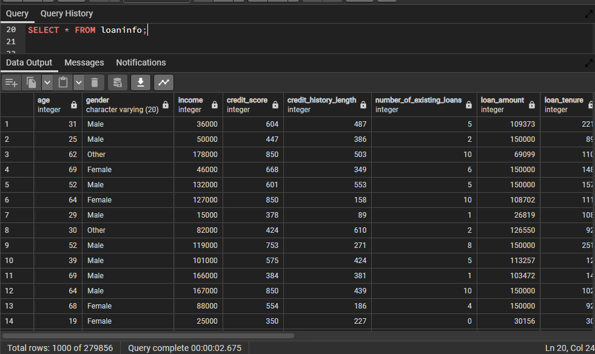

# Comprehensive-Insights-into-India's-Two-wheeler-Loan-Applicant-Profiles
This provides a comprehensive overview of potential loan applicants' profiles, specifically tailored for the Indian demographic. It encapsulates a range of features, from basic demographics to financial details, that can be instrumental in assessing the creditworthiness of an individual.

## Introduction
In today's highly competitive financial services sector, data-driven decision-making is crucial for maintaining a competitive edge and ensuring customer satisfaction. This project aims to provide a comprehensive data analysis and insights into various aspects of a financial services organization, enabling better understanding of customer behavior, risk assessment, and strategic planning.
In today's highly competitive financial services sector, data-driven decision-making is crucial for maintaining a competitive edge and ensuring customer satisfaction. This project, titled 'LoanInfo Analysis,' aims to provide a comprehensive data analysis and insights into various aspects of a financial services organization. By leveraging SQL, we will delve into the intricacies of customer behavior, risk assessment, and strategic planning. SQL will be our primary tool for extracting, transforming, and analyzing the data from the 'LoanInfo' database, enabling us to make informed decisions and optimize our operations in this dynamic industry."

## Problem Statement
The financial services company faces several key challenges that need to be addressed:  
Understanding customer demographics and preferences to tailor financial products.  
Assessing the risk profile of customers to make informed lending decisions.  
Identifying patterns of loan default and minimizing associated losses.  
Optimizing marketing strategies based on customer attributes.  
Analyzing the performance of different financial products.  
 In order to help solve these challenges, I had to answer the following questions 
1. What is the average loan amount for each occupation type (e.g., Doctor, Software Engineer, Banker, etc.)?
2. How many applicants have a credit history length of less than 3 years and a credit score below 500?
3. What is the highest loan-to-value (LTV) ratio for female applicants who are self-employed?
4. What is the average income of applicants from Bengaluru, Karnataka, who have a credit score above 600?
5. How many applicants have an income greater than 100,000 and a profile score above 80?.
6. What is the total loan amount requested by applicants in each state?
7. How many applicants are salaried workers and have more than 5 existing loans?
8. What is the average credit score for applicants in the age group of 50 to 60 years?
9. What is the distribution of occupations among female applicants who are existing customers?
10. What is the number of Male and Female Applicants?
11. What is the Average Credit Score of Self-Employed Applicants?
12. What is the number of Existing Customers and their Average Loan Tenure?

## Project Objective
In today's highly competitive financial services sector, data-driven decision-making is crucial for maintaining a competitive edge and ensuring customer satisfaction. This project aims to provide a comprehensive data analysis and insights into various aspects of a financial services organization. By leveraging SQL, we will delve into the intricacies of customer behavior, risk assessment, and strategic planning. SQL will be our primary tool for extracting, transforming, and analyzing the data from the 'LoanInfo' database, enabling us to make informed decisions and optimize our operations in this dynamic industry.  
Additionally, Power BI will play a pivotal role in this project, as we will use it to create interactive, communicative, and excellent dashboards. These dashboards will visually represent our findings, making it easier to communicate insights and trends to stakeholders. By combining SQL's data processing capabilities with Power BI's visualization prowess, we aim to provide a holistic and powerful solution for enhancing our organization's data-driven decision-making process. 
**Dataset:** I was provided with the credit dataset containing the following columns
•	Age 
•	Gender
•	Income 
•	Credit score 
•	Credit history length
•	Number of existing loans
•	Loan amount
•	Loan tenure
•	Existing customer
•	State
•	City
•	LTV ratio
•	Employment profile
•	Profile score
•	Occupation

## Data Analysis
I conducted an in-depth analysis of the provided customer loan dataset, which included information on Customer Demographics, Credit Risk Assessment, Loan Default Analysis, Customer Segmentation, Financial Product Performance and more. The analysis covered a wide range of key questions like distribution of loan tenure among applicants with a credit score above 750, total loan amount requested by applicants in each state, number of Male and Female Applicants, average credit score for applicants in the age group of 50 to 60 years.
The first thing I had to do was to replicate the table into my SQL database.

The table has been created in the SQL database 

1. What is the average loan amount for each occupation type (e.g., Doctor, Software Engineer, Banker, etc.)?  
This query allows us to see the average loan amount requested by applicants from different occupation types. It helps identify borrowing patterns and preferences based on the 
occupation.

2. How many applicants have a credit history length of less than 3 years and a credit score below 500?  
This query gives us the count of applicants who have a relatively short credit history (less than 3 years which is 36 months since the column is in months) and a low credit score (below 500). It's useful for identifying applicants with potentially higher risk profiles.  
We have 4642 applicants have a credit history length of less than 3 years and a credit score below 500.

3. What is the highest loan-to-value (LTV) ratio for female applicants who are self-employed?  
This query helps find the highest LTV ratio among self-employed female applicants. LTV ratios indicate the risk associated with loans, so identifying the highest ratio for this specific group can provide insights into potential risk factors.

   
